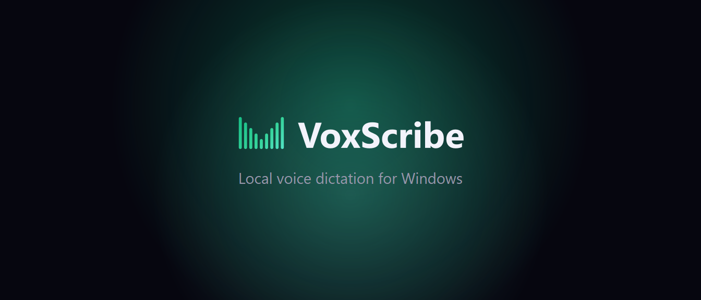
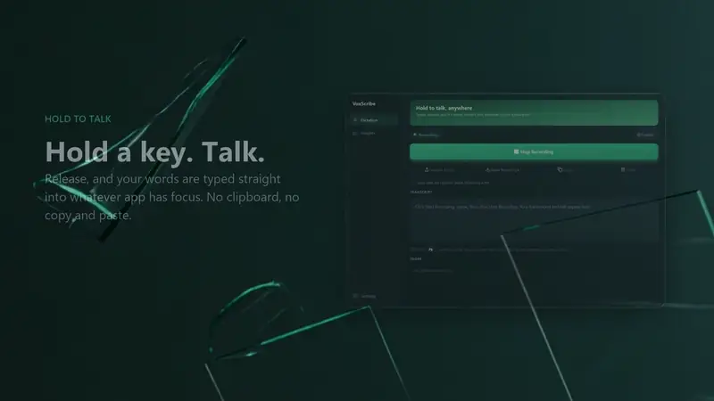
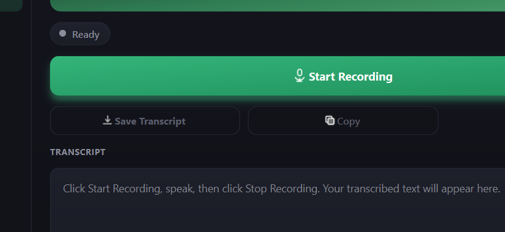
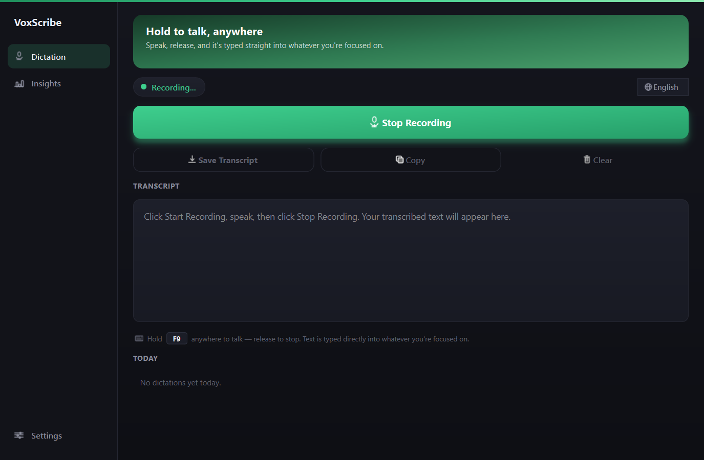
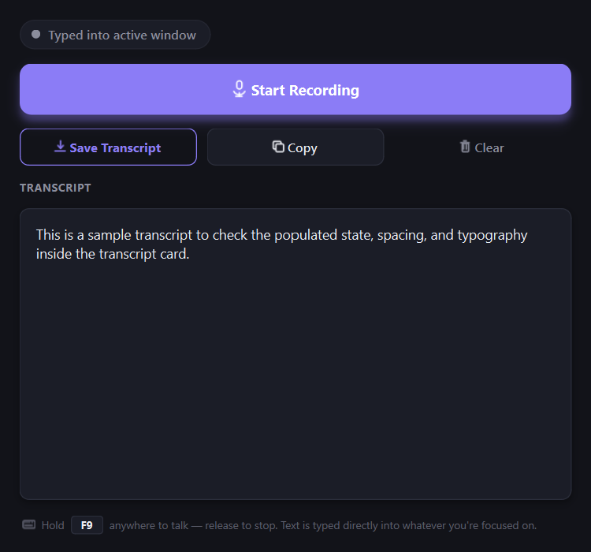

<p align="center">
  
</p>

<p align="center">
  <a href="https://github.com/ahmedhmam1994/voxscribe-ai-voice-dictation/actions/workflows/ci.yml"></a>
  <a href="https://github.com/ahmedhmam1994/voxscribe-ai-voice-dictation/releases/latest"></a>
  <a href="https://github.com/ahmedhmam1994/voxscribe-ai-voice-dictation/releases"></a>
  <a href="LICENSE"></a>
</p>

# VoxScribe

A free, open-source Windows desktop voice dictation app. Hold a global hotkey anywhere on your system, talk, release. Your speech is transcribed **locally on your PC** and typed directly into whatever window has focus.

Free and privacy-first: your voice audio is never uploaded anywhere.

<p align="center">
  <a href="https://github.com/ahmedhmam1994/voxscribe-ai-voice-dictation/raw/main/docs/assets/voxscribe-features.mp4">
    
  </a>
  <br>
  <sub>Click to watch the full 53 second feature overview.</sub>
</p>

## Features

- **Hold-to-talk hotkey (F9 by default, changeable):** works system-wide, in any app; change it from the tray menu's "Change Hotkey..."
- **Direct typing into the focused window:** not clipboard/paste, so it never overwrites what you've copied
- **100% local transcription:** powered by [faster-whisper](https://github.com/SYSTRAN/faster-whisper) running on your CPU; your audio never leaves your machine
- **Rule-based text cleanup:** strips filler words ("um", "uh", "like", "you know") without calling any paid AI API
- **Floating status indicator:** small pill shows Recording/Transcribing state
- **Runs from the system tray:** starts hidden, stays out of your way

## Download

Grab the latest installer from the [Releases page](https://github.com/ahmedhmam1994/voxscribe-ai-voice-dictation/releases).

> **Note on Windows SmartScreen:** since VoxScribe is a new, unsigned app that hooks the keyboard (for the hotkey and to type text), Windows may show a "Windows protected your PC" warning on first run. Click **More info → Run anyway** to proceed. This is expected for unsigned indie software and not a sign of a problem.

The installer does not require admin rights (per-user install). On first launch, VoxScribe downloads the Whisper speech model (a few hundred MB) from Hugging Face. This requires an internet connection once; after that, transcription works fully offline.

## Requirements

- Windows 10 or 11
- A working microphone
- ~1GB free disk space (app + downloaded model)

## How it works

1. Hold **F9** (or your chosen hotkey, see the tray menu's "Change Hotkey...")
2. Speak
3. Release the hotkey. The transcribed, cleaned-up text is typed into whatever app you're focused in

<p align="center">
  
  
  
</p>

## Privacy

- Audio is captured, transcribed, and discarded locally: nothing is sent to a server
- Text cleanup is regex-based, running entirely on your machine: no AI API calls
- The only network request VoxScribe makes is the one-time Whisper model download on first run

## Building from source

```
python -m venv venv
venv\Scripts\pip install -r requirements.txt
venv\Scripts\python.exe main.py
```

See [CLAUDE.md](CLAUDE.md) for architecture notes and build/packaging commands (PyInstaller + Inno Setup).

## Code signing

The installer is currently unsigned, so Windows SmartScreen shows an "unknown publisher" warning on first run. VoxScribe is applying for a free certificate through the [SignPath Foundation](https://signpath.org)'s open-source program: see [CODE_SIGNING.md](CODE_SIGNING.md) for the policy that program requires. Paid alternatives also work: a traditional OV/EV certificate from a CA (SSL.com, Sectigo, roughly $70 to $400/yr), or [Microsoft Trusted Signing](https://learn.microsoft.com/en-us/azure/trusted-signing/) via Azure (usage-based, no hardware token required). With any of these, run `scripts\sign_release.ps1` after building; see that script's header comment for exact usage.

## License

[MIT](LICENSE)
